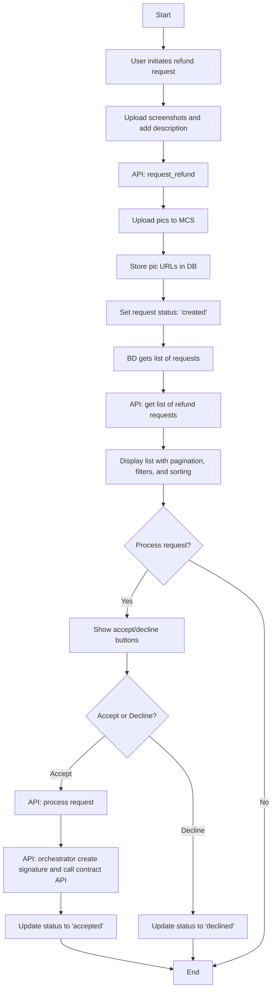

Creating a flowchart to represent the refund request process involves illustrating the sequence of steps and interactions with APIs. Below is a textual description of how the flowchart would be structured:

1. **Start**  
   - User initiates a refund request.

2. **Step 1: User Request Refund**  
   - **Input**: User uploads screenshots (max 3, 5MB limit) and adds comments/description.  
   - **Process**:  
     - Call **API: request_refund**  
       - Upload pictures to MCS.  
       - Store picture URLs in the database.  
       - Save the description.  
       - Set request status to `created`.

3. **Step 2: BD Get a List of Requests**  
   - **Process**:  
     - Call **API: get list of refund requests**  
       - Implement pagination.  
       - Filter by status/date.  
       - Sort by date.  
   - **Output**: Display list of requests with `created` status for further processing.

4. **Step 3: Process a Request**  
   - **Decision**: Show buttons to either accept or decline the request.  
   - **If Accepted**:  
     - Call **API: process request**  
     - Call **API: orchestrator create signature and call contract API to refund**  
     - Update refund request status to `accepted` in CRM.  
   - **If Declined**:  
     - Update refund request status to `declined` in CRM.

5. **End**  
   - Process completes with either acceptance or declination of the refund request.

To visualize this as a flowchart, you can use a flowchart tool like Lucidchart, Microsoft Visio, or draw.io. The flowchart will include:

- **Rectangles** for processes (e.g., "User Request Refund").
- **Diamonds** for decision points (e.g., "Show buttons to accept or decline").
- **Arrows** to indicate the flow of the process.
- **Parallelograms** for inputs/outputs (e.g., "User uploads screenshots").

If you would like a graphical representation, you can use the above description to create it in any of the mentioned tools.