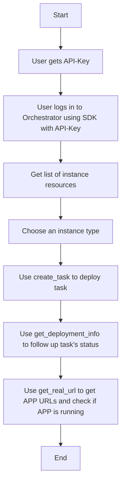
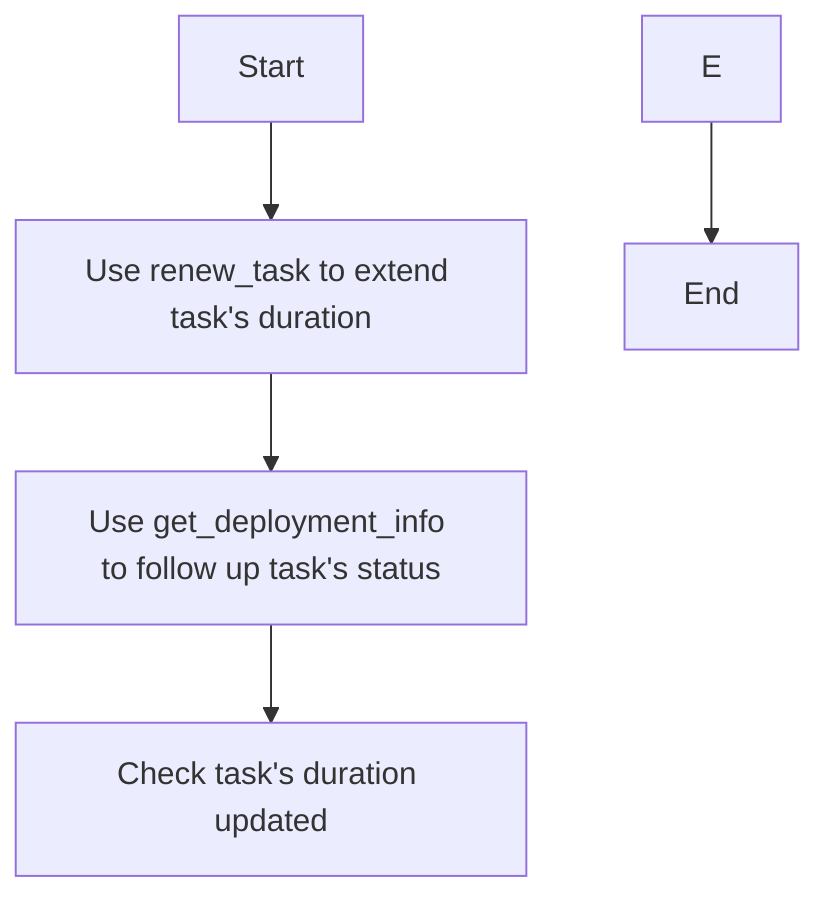
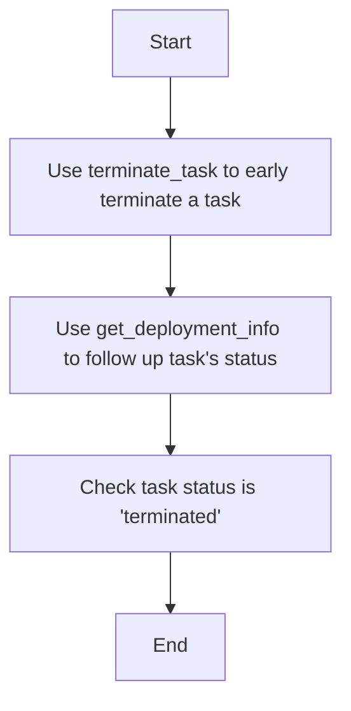

# Steps using SDK

## Main Logic

To deploy task:

- user get API-Key
- user use API-Key to login in Orchestrator using SDK
- get a list of instance resources
- choose an instance type
- use `create_task` to deploy task
- use `get_deployment_info` to follow up task's status
- use `get_real_url` to get APP URLs and to check if APP is running

To renew task:

- use `renew_task` to extend task's duration
- use `get_deployment_info` to follow up task's status
- to check `duration` is updated

To terminate task:

- use `terminate_task` to early terminate a task
- use `get_deployment_info` to follow up task's status
- to check task status is updated to `terminated`

### 1. Deploying a Task

### 2. Renewing a Task

### 3. Terminating a Task

