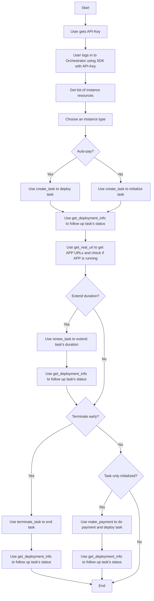

Steps using SDK:

- user get API-Key
- user use API-Key to login in Orchestrator using SDK
- get a list of instance resources
- choose an instance type
- use `create_task` to deploy task (auto_pay=True) or to only initialize task (auto_pay=False)
- use `get_deployment_info` to follow up task's status
- use `get_real_url` to get APP URLs and to check if APP is running
- use `renew_task` to extend task's duration
- still use `get_deployment_info` to follow up task's status
- or use `terminate_task` to early terminate a task
- still use `get_deployment_info` to follow up task's status
- if task is only initialized, use `make_payment` to do payment and deploy task

