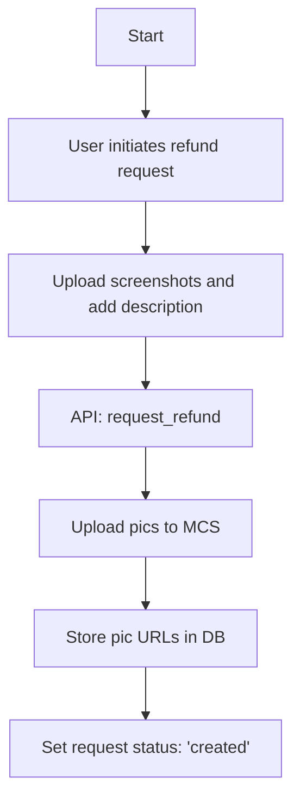
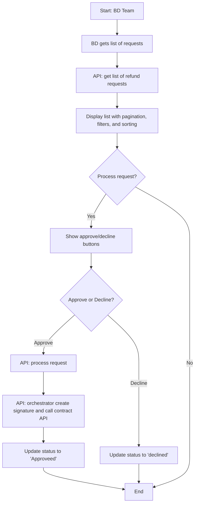

# Design of Refund Request Logic

## Business Logic

1. **Step 1: User Request Refund**  
   - **Input**: User uploads screenshots (max 3, 5MB limit) and adds comments/description.  
   - **Process**:  
     - Call **API: request_refund** (CRM)
       - Upload pictures to MCS.  
       - Store picture URLs in the database.  
       - Save the description.  
       - Set request status to `created`.

2. **Step 2: BD Get a List of Requests**  
   - **Process**:  
     - Call **API: get list of refund requests**  (CRM)
       - Implement pagination.  
       - Filter by status/date.  
       - Sort by date.  
   - **Output**: Display list of requests with `created` status for further processing.

3. **Step 3: Process a Request**  
   - **Decision**: Show buttons to either Approve or decline the request.  
   - Call **API: process request** (CRM)
   - **If Approveed**:  
     - Call **API: orchestrator create signature and call contract API to refund** (Orchestrator)
     - Update refund request status to `approveed` in CRM.  
   - **If Declined**:  
     - Update refund request status to `declined` in CRM.

### Part 1: User Flow



### Part 2: BD Team Flow



## Summary

TODO:

### API

- **API: request_refund** (CRM)
- **API: get list of refund requests**  (CRM)
- **API: process request** (CRM)
- **API: orchestrator create signature and call contract API to refund** (Orchestrator)

### `refund_request` Table

```sql
CREATE TABLE refund_request (
    id INT AUTO_INCREMENT PRIMARY KEY,
    user_name VARCHAR(255) NOT NULL COMMENT 'Name of the user requesting the refund',
    user_wallet VARCHAR(255) NOT NULL COMMENT 'Wallet address of the user',
    user_email VARCHAR(255) NOT NULL COMMENT 'Email address of the user',
    user_phone VARCHAR(20) COMMENT 'Phone number of the user (optional)',
    request_pics JSON COMMENT 'JSON array of URLs for refund request pictures',
    request_desc TEXT COMMENT 'Detailed description of the refund request',
    status ENUM('created', 'approved', 'declined') NOT NULL DEFAULT 'created',
    refund_txhash VARCHAR(255) COMMENT 'Transaction hash of the refund (if approved)',
    process_memo TEXT COMMENT 'Admin comments or notes on the refund process',
    created_at TIMESTAMP DEFAULT CURRENT_TIMESTAMP,
    processed_at TIMESTAMP NULL,
    updated_at TIMESTAMP DEFAULT CURRENT_TIMESTAMP ON UPDATE CURRENT_TIMESTAMP,
    deleted_at TIMESTAMP NULL
) ENGINE=InnoDB DEFAULT CHARSET=utf8mb4 COLLATE=utf8mb4_unicode_ci;
```
