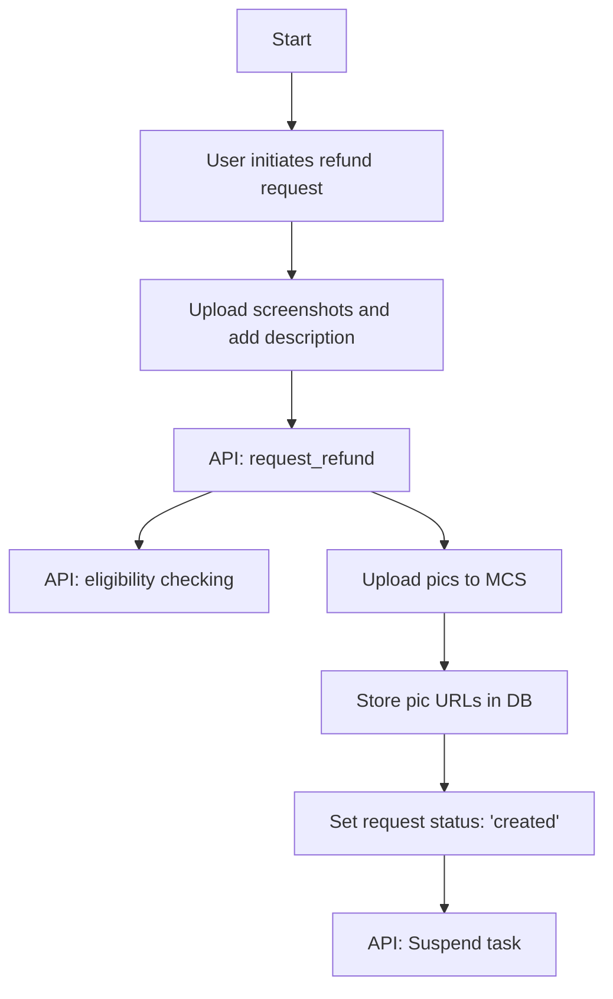
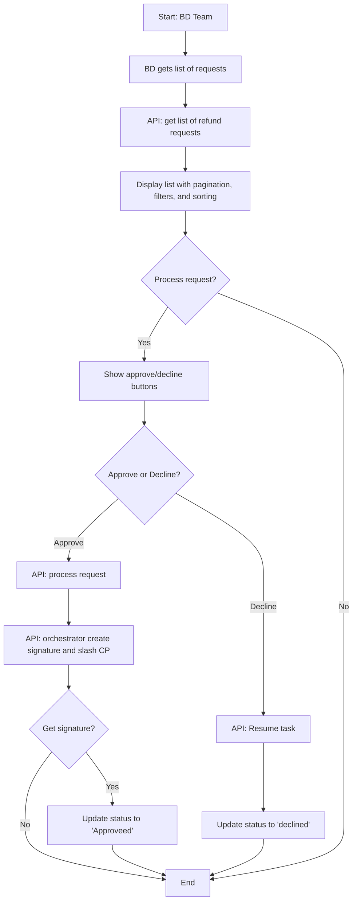

# Design of Refund Request Logic

## Business Logic

1. **Step 1: User Request Refund**  
   - **Input**: User uploads screenshots (max 3, 5MB limit) and adds comments/description.  
   - **Process**:  
     - Call **API: request_refund** (CRM)
       - Upload pictures to MCS.  
       - Store picture URLs in the database.  
       - Save the description.  
       - Set request status to `created`.
       - Call **API: eligibility checking** (Orchestrator) to check if task is eligible for refund (in cooling down window)
       - Call **API: suspend task** (Orchestrator) to stop task being completed automatically
         - change task status to `suspended`

2. **Step 2: BD Get a List of Requests**  
   - **Process**:  
     - Call **API: get list of refund requests**  (CRM)
       - Implement pagination.  
       - Filter by status/date.  
       - Sort by date.  
   - **Output**: Display list of requests with `created` status for further processing.

3. **Step 3: Process a Request**  
   - **Decision**: Show buttons to either Approve or decline the request.  
   - Call **API: process request** (CRM)
   - **If Approveed**:  
     - Call **API: orchestrator create signature and call contract API to refund** (Orchestrator)
       - Change task status to `Refunded` and jobs status to `Refunded` 
       - Generate signature for user to claim refund
       - Get task collateral amount from task manager contract
       - Slash CP by amount
     - Update refund request status to `approveed` in CRM.
     - Return signature to user for claim refund by himself.
   - **If Declined**:  
     - Update refund request status to `declined` in CRM.
     - Call **API: resume task** (Orchestrator) to let task being processed forward
       - If necessary (task has passed cooling down period), call `completeTask` on contract

### Part 1: User Flow



### Part 2: BD Team Flow



## Summary

TODO:

### API

- **API: request_refund** (CRM)
- **API: get list of refund requests**  (CRM)
- **API: process request** (CRM)
- **API: orchestrator create signature and call contract API to refund** (Orchestrator)
- **API: eligibility checking** (Orchestrator)
- **API: suspend task** (Orchestrator)
- **API: resume task** (Orchestrator)

### `refund_request` Table (in CRM)

```sql
CREATE TABLE `refund_request` (
    `id` int NOT NULL AUTO_INCREMENT,
    `user_name` varchar(255) NOT NULL COMMENT 'Name of the user requesting the refund',
    `user_wallet` varchar(255) NOT NULL COMMENT 'Wallet address of the user',
    `user_email` varchar(255) NOT NULL COMMENT 'Email address of the user',
    `user_phone` varchar(20) DEFAULT NULL COMMENT 'Phone number of the user (optional)',
    `task_uuid` varchar(64) NOT NULL COMMENT 'UUID of task associated with the refund request',
    `request_pics` json DEFAULT NULL COMMENT 'JSON array of URLs for refund request pictures',
    `request_desc` text COMMENT 'Detailed description of the refund request',
    `status` varchar(64) NOT NULL,
    `refund_signature` varchar(255) DEFAULT NULL COMMENT 'Signature for refund (if approved)',
    `process_comments` text COMMENT 'Admin comments or notes on the refund process',
    `created_at` int DEFAULT NULL,
    `processed_at` int DEFAULT NULL,
    `updated_at` int DEFAULT NULL,
    `deleted_at` int DEFAULT NULL,
    PRIMARY KEY (`id`)
) ENGINE = InnoDB DEFAULT CHARSET = utf8mb4 COLLATE = utf8mb4_0900_ai_ci;
```


### `refund_record` Table (in Orchestrator)


```sql
CREATE TABLE `refund_record` (
    `id` int NOT NULL AUTO_INCREMENT,
    `task_uuid` varchar(64) NOT NULL,
    `refund_signature` varchar(255) DEFAULT NULL COMMENT 'Signature for refund (if approved)',
    `cp_list` json,
    `slash_amount_each` double DEFAULT NULL,
    `created_at` int DEFAULT NULL,
    `updated_at` int DEFAULT NULL,
    PRIMARY KEY (`id`)
) ENGINE = InnoDB DEFAULT CHARSET = utf8mb4 COLLATE = utf8mb4_0900_ai_ci;
```