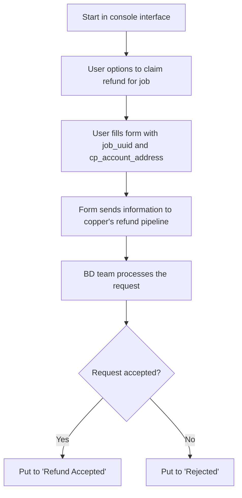
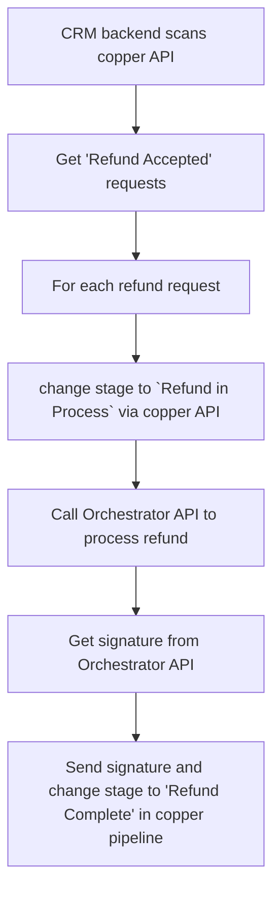
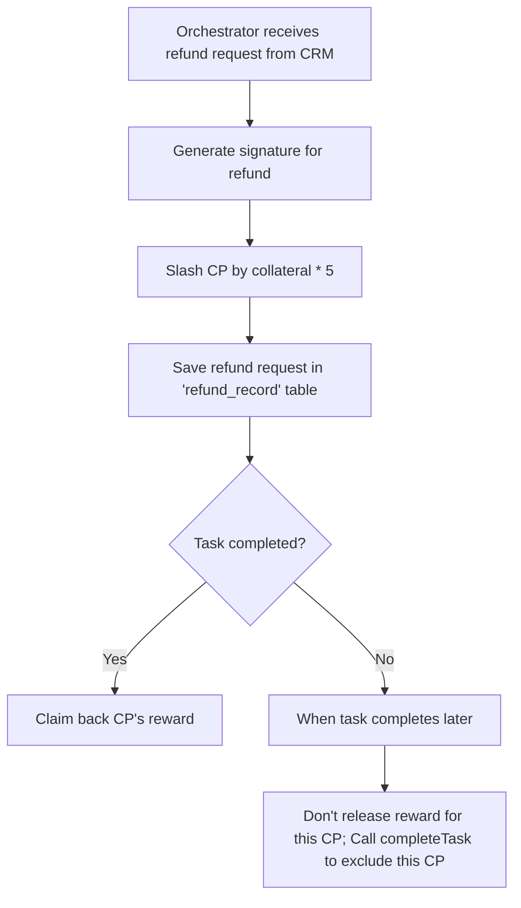

# Design of Refund Request Logic

## Refund request logic

- start in console interface
- user has options to claim refund for some particular job(cp)
- user fill information in a form (must include job_uuid, cp_account_address)
- the form send information into copper's refund pipeline
- BD team process the request
- if request is accepted, put it to `Refund Accepted`
- if request is rejected, put it to `Rejected`



## CRM process refund flow

- CRM backend scan copper API to get `Refund Accepted` refund requests
- For each scanned refund request, change stage to `Refund in Process`
- for each refund request, CRM call Orchestrator API to process refund
- Get signature from Orchestrator API
- Send signature and change refund request stage to `Refund Complete` to copper pipeline




## Orchestrator process refund logic

- Orchestrator receives refund request from CRM, parameters: `cp_account_address` and `job_uuid`, `task_uuid`
- Orchestrator generate signature for refund
- Slash CP by it's collateral * 5 (5 times penalty) `slashCollateral(task_uuid, cp_account_address, 5*base_collateral)`
- Save refund request for CP in `refund_record` table (`job_uuid`, `cp_account_address`, slashed_amount, task_uuid, timestamp, etc)
- if task has been completed, **claim back CP's reward** (call `reclaimReward(task_uuid, cp_account_address)`)
- if task has not been completed yet, when complete task, don't release reward for this CP; when complete task later, call `completeTask(task_uuid, cp_address_list)` to exclude this CP





### `refund_request` Table (in CRM)

```sql
CREATE TABLE `refund_request` (
    `id` int NOT NULL AUTO_INCREMENT,
    `copper_id` int NOT NULL,
    `user_email` varchar(255) DEFAULT NULL COMMENT 'Email address of the user',
    `user_wallet` varchar(255) NOT NULL COMMENT 'Wallet address of the user',
    `task_uuid` varchar(64) NOT NULL COMMENT 'UUID of task associated with the refund request',
    `job_uuid` varchar(64) NOT NULL COMMENT 'UUID of job associated with the refund request',
    `cp_account_address` varchar(64) NOT NULL COMMENT 'cp account address associated with the refund request',
    `stage` varchar(64) DEFAULT NULL,
    `refund_signature` varchar(255) DEFAULT NULL COMMENT 'Signature for refund (if approved)',
    `created_at` int DEFAULT NULL,
    `processed_at` int DEFAULT NULL,
    `completed_at` int DEFAULT NULL,
    `deleted_at` int DEFAULT NULL,
    PRIMARY KEY (`id`)
) ENGINE = InnoDB DEFAULT CHARSET = utf8mb4 COLLATE = utf8mb4_0900_ai_ci;
```


### `refund_record` Table (in Orchestrator)


```sql
CREATE TABLE `refund_record` (
    `id` int NOT NULL AUTO_INCREMENT,
    `task_uuid` varchar(64) NOT NULL,
    `job_uuid` varchar(64) NOT NULL,
    `user_wallet` varchar(255) NOT NULL,
    `cp_account_address` varchar(255) NOT NULL,
    `refund_signature` varchar(255) DEFAULT NULL,
    `slash_amount` double DEFAULT NULL,
    `created_at` int DEFAULT NULL,
    `updated_at` int DEFAULT NULL,
    PRIMARY KEY (`id`)
) ENGINE = InnoDB DEFAULT CHARSET = utf8mb4 COLLATE = utf8mb4_0900_ai_ci;
```