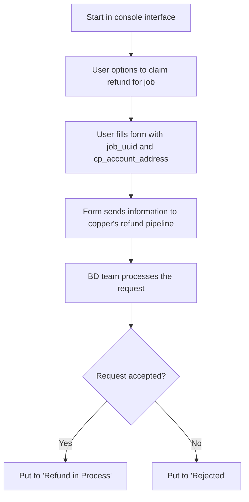
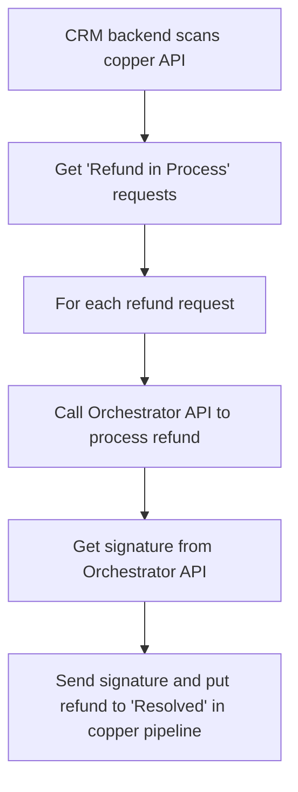

# Design of Refund Request Logic

## Refund request logic

- start in console interface
- user has options to claim refund for some particular job(cp)
- user fill information in a form (must include job_uuid, cp_account_address)
- the form send information into copper's refund pipeline
- BD team process the request
- if request is accepted, put it to `Refund in Process`
- if request is rejected, put it to `Rejected`

## CRM process refund flow

- CRM backend scan copper API to get `Refund in Process` refund requests
- for each refund request, CRM call Orchestrator API to process refund
- Get signature from Orchestrator API
- Send signature and put refund to `Resolved` to copper pipeline

## Orchestrator process refund logic

- Orchestrator receives refund request from CRM, parameters: `cp_account_address` and `job_uuid`
- Orchestrator generate signature for refund
- Slash CP by it's collateral * 5 (5 times penalty)
- Save refund request for CP in `refund_process` table (`job_uuid`, `cp_account_address`, slashed_amount, task_uuid, timestamp, etc)
- if task has been completed, **claim back CP's reward** (call `reclaimReward(task_uuid, cp_account_address)`)
- if task has not been completed yet, when complete task, don't release reward for this CP; when complete task later, call `completeTask(task_uuid, cp_address_list)` to exclude this CP

